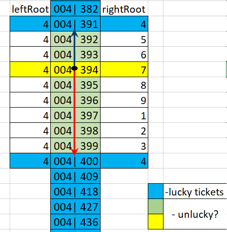

# luckyTickets
 Semi-smart solution for counting lucky tickets in range
 
## Задача
Найти количество счастливых билетов в диапазоне 000000...999999. Билет будет являться счастливым, если цифровые корни "половинок" числа одинаковые.
Данные передаются запросом script.php?first=123456&end=999999 либо из .html (2а инпута и баттон).  
## Результат  
Класс **LuckyTickets**, содержащий публичные методы:  
**__construct(int $size)** - конструктор, принимает "размерность" номера билета;  
**count(int $min, int $max): int** - возвращает количество билетов со счастливыми номерами в диапазоне от min до max;  
**range(int $min, int $max)** - возвращает генератор, представляющий набор счастливых номеров в диапазоне от min до max;
**getTopNumber(int $number): string** - возвращает строковое представление ближайшего к number счастливого номера (сверху). Если number - счастливый возвращает его;  
**getBottomNumber(int $number): string** - возвращает строковое представление ближайшего к number счастливого номера (снизу). Если number - счастливый возвращает его.  
**script.php** - обработчик GET запроса.  
**index.html** - содержит форму.  

## Подход к решению
Самый очевидный, но не самый эффективный - перебор. Решение перебором было имплементировано только для сравнения
с обсуждаемым ниже (не выкладывал).  
Цифровой корень любого числа  в десятичной системе счисления меняется от 1 до 9. Ноль пока не рассматриваем. Кроме этого, заметим, что для двузначных чисел количество повторений одного и того же корня будет равно 11, для трехзначных чисел количество повторений одного и того же корня будет равно 111, для четырехзначных - 1111 и т.д. 
Видимо, общая формула для количества повторений корня будет Q = (10^K - 1)/9, где К - количество разрядов.  
Шестизначный номер билета можно рассматривать как композицию трехзначных "половинок". И в каждой из этих "половинок" какой-то из корней будет повторяться 111 раз. Количество совпадений корня в "половинках" всех шестизначных билетов будет опередляться 111 * 111, а для все корней - 111 * 111 * 9 = 110889. А с учетом билета с номером 000000, если такой существует, 110889 + 1 = 110890.  
В нашем случае диапазон поиска номеров задается пользователем, поэтому рассуждаем дальше.  
Предположим, что имеем два билета со счастливыми номерами 325685 и 412979. Количество счастливых билетов(номеров) в этом диапазоне можно представить в виде суммы N1 + N2 + N3, где:  
N1 - количество счастливых билетов в диапазоне 326000...411999,  
N2 - количество счастливых билетов в диапазоне 412000...412979,  
N3 - количество счастливых билетов в диапазоне 325685...325999.  
Начнем с N1. Для каждой левой половинки (326, 327, 328,..., 411) будет 111 совпадений с правыми половинками,  
т.е. N1 = (411 - 326 + 1) * 111 = 9546 или N1 = (412 - 325 -1) * 111, если использовать левые части номеров исходных билетов (325685 и 412979).  
Для нахождения N2 можно воспользоваться тем, что правые части номеров билетов в диапазоне 412000...412979 будут иметь точно такой же цифровой корень (7), как и левая часть (412). Т.е. нам нужны числа 412007, 412016, 412025, 412034,...  
Если внимательно присмотреться к правым частям, увидим арифметическую прогрессию: 7, 16, 25, 34. Последним членом этой прогрессии будет число 979(правая часть номера 412979).  
Т.е. N2 будет равно количеству членов арифметической прогрессии в диапазоне 7, 16, ..., 979.  
N2 = (979 - 7) / 9 + 1 = 109.  
В случае с N3 так просто не получится, потому как на нас интересуют значения в диапазоне 685...999. Однако полное количество повторений в диапазоне 000...999 известно, поэтому можно посчитать количество членов прогресии в диапазоне 000...685, и вычесть его из 111.  
N3 = 111 - [(685 - 1) / 9 + 1]. Поскольку 685 входит в искомый нами диапазон, то значение N3 нужно увеличить на 1:  
N3 = 111 - [(685 - 1) / 9 + 1] + 1 = 111 - (685 - 1) / 9 = 35.
В сумме полное количество счастливых билетов N = N1 + N2 + N3 = 9546 + 109 + 35 = 9690.  
Если предположить, что данный подход работает, осталось решить задачу по нахождению счастливых номеров наиболее близких к тем значениям, который вводит пользователь. И придумать, что делать с нулем...
## Continued наступил
По условию задачи, пользователь вводит два значения (границы диапазона). Под наиболее близкими счастливыми  номерами будем понимать первое счастливое число, которое больше нижней границы и первое счастливое число, которое меньше верхней границы. К примеру, если пользователь ввел значения 123450 и 234569, то наиболее близкими будут числа 123456 и 234567. Чтобы разобраться как зная обычное число (не будем называть его несчастливым) найти счастливое, взглянем на картинку:

Поскольку между каждыми (почти) двумя счастливыми номерами находятся числа, у которых цифровой корень правой части изменяется в пределах от 1 до 9 (по-прежнему используем десятичную СИ), разницу между цифровыми корнями правой и левой частей числа можно использовать для нахождения ближайших счастливых чисел. 
 
 

